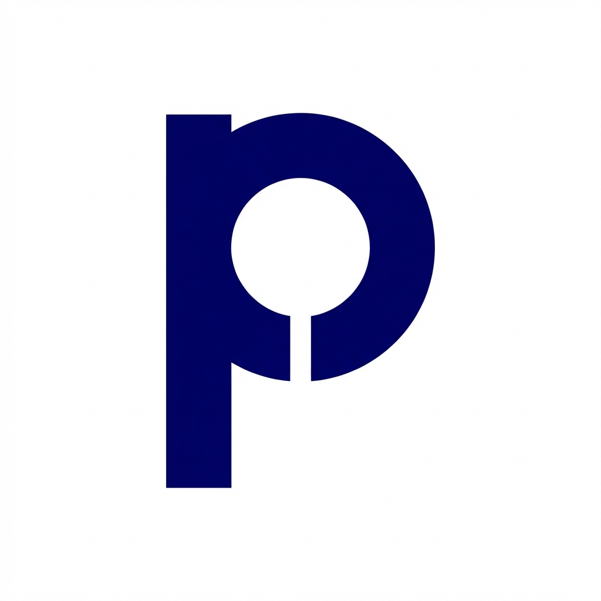

<div align="center">
  
</div>

<br/>

**Proovit** is a mobile application for creating challenge-based groups where participants submit photo check-ins as proof of completion. Inspired by GymRats, Proovit is built to support **any activity** — reading, running, gym workouts, diet goals, studying, and more — with a robust gamification layer designed to drive long-term engagement and retention.

***

## Overview

Proovit enables users to form groups around shared challenges, track progress through visual proof, and compete on leaderboards. Its flexible architecture supports both collaborative group challenges and individual solo challenges, making it adaptable to virtually any habit or goal.

### Why Proovit

- **Social accountability:** Groups develop their own identity and culture, fostering healthy competition among members.
- **Activity-agnostic:** Supports any type of challenge, from fitness routines to academic goals.
- **Engagement-driven:** Gamification mechanics combined with visual proof submission create strong daily-use habits.
- **Scalable by design:** A single group can host multiple simultaneous challenges, increasing long-term retention.

***

## Core Features

### Groups
- Create themed groups with custom descriptions and defined date ranges.
- Add multiple challenges within a single group (e.g., 📚 100 pages/day, 🏃 10 km/day, 💪 5 gym sessions/week).

### Challenge Creation
- **Group Mode:** Group creators define challenges that all members participate in.
- **Solo Mode:** Individual challenges (e.g., "21 days without soda") with a shareable invite link.

### Photo Check-in
- Full-screen native camera for capturing activity proof.
- Instant success feedback with confetti animation and haptic response.
- Clear visual status indicators: ✅ Done, ⏳ Pending, ❌ Missed.

### Gamification
- **Points:** Base score with streak bonuses and early-bird multipliers.
- **Streaks:** Visual streak indicators with a growing flame 🔥 icon.
- **Leaderboards:** Global rankings and per-challenge rankings.
- **Badges:** Unlockable achievements such as "Streak Master."

***

## Screen Structure

The app uses a **5-tab bottom navigation**:

1. 🏠 **Home** — Overview of your progress and daily summary
2. 🔍 **Search** — Discover new groups and challenges
3. ✅ **Checklist** — Your daily tasks and pending photo check-ins
4. 👥 **My Groups** — Your active groups, challenge details, and leaderboards
5. 👤 **Profile** — Overall stats, badges, and account settings

**Stack flow:** Home / My Groups → Challenge List → Photo Check-in

***

## MVP Scope

The initial MVP validates the core concept through these essential flows:

1. **Home / Checklist** — Viewing daily pending tasks.
2. **My Groups** — Viewing user's active groups.
3. **Check-in** — Native camera screen for photo submission.
4. **Leaderboard** — Real-time group ranking.

***

## Tech Stack

| Layer | Technology |
|---|---|
| Frontend | React Native + Expo |
| Navigation | React Navigation |
| Backend & Database | Supabase (Auth, Database, Storage) |
| Language | TypeScript |

***

## Project Structure

```text
proovit/
├── src/
│   ├── components/       # Reusable UI components
│   ├── navigation/       # Route and tab configuration
│   ├── screens/          # App screens (Auth, Home, Checkin, etc.)
│   └── services/         # External integrations (e.g., supabase.ts)
├── assets/               # Images and fonts
├── app.json              # Expo configuration
└── package.json          # Project dependencies
```

***

## Getting Started

1. **Clone the repository**
   ```bash
   git clone https://github.com/freitasbtw/proovit.git
   cd proovit
   ```

2. **Install dependencies**
   ```bash
   npm install
   # or
   yarn install
   ```

3. **Start the Expo development server**
   ```bash
   npx expo start
   ```

4. **Run on a device or emulator**
   Scan the QR code with **Expo Go** on your mobile device, or launch an Android/iOS emulator directly from the terminal.